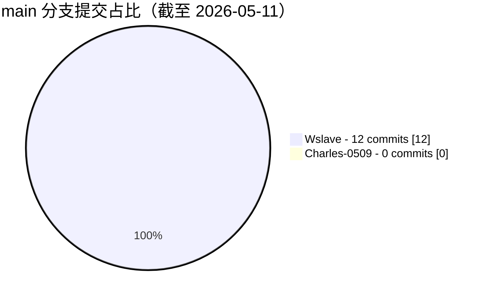

# ESP32 本地 AI 语音交互控制系统

本仓库对应毕业论文《基于 ESP32 与本地 AI 上位机的语音交互控制系统的设计与实现》。系统采用论文中的端边协同思路，将语音链路拆分为 `ESP32 语音终端 + 本地 AI 上位机 + Web 控制台` 三个部分：ESP32 负责采音、VAD 触发、播放与设备侧状态反馈；本地上位机负责识别、语义理解、指令推理和服务协调；Web 控制台负责配置、状态观测、日志查看和联调。

与完全依赖云端语音服务的方案相比，本项目更强调局域网内可部署、可调试、可观察的完整闭环。代码结构也按这一思路整理为前端、后端和硬件三层，便于论文说明、系统演示和后续裁剪。

## 系统架构

按照论文第 2 章“系统总体设计”的划分，当前仓库中的代码可以对应为以下三层：

1. `hardware/`：ESP32 语音终端
   - 负责 I2S 麦克风采样、语音活动检测、音频封装、网络传输、音频播放和外设控制。
   - 当前核心入口是 `hardware/main/main.cc`，由 `Application` 统一调度音频、协议、状态机、OTA 和板级外设。
   - `hardware/main/audio`、`hardware/main/protocols`、`hardware/main/display`、`hardware/main/led` 分别对应论文中的采音、通信、显示和反馈模块。

2. `backend/`：本地 AI 上位机
   - `backend/manager-api` 是基于 Spring Boot 的管理后端，承担用户认证、设备管理、参数管理、模型管理、知识库、OTA 和服务端配置接口。
   - `backend/xiaozhi-server` 是 Python 实时语音服务，负责 WebSocket 语音链路、VAD/ASR/LLM/TTS 模块编排、视觉分析接口和运行日志输出。
   - 两个后端合在一起，对应论文中的“上位机 AI 语义处理模块 + 状态管理模块”。

3. `frontend/`：Web 控制台
   - 基于 Vue 2 + Element UI 构建。
   - 页面包含设备管理、模型配置、参数管理、知识库管理、服务端管理、OTA 管理、音色资源、声纹和日志相关功能。
   - 它对应论文中的 GUI 交互模块，用于显示识别结果、设备状态、服务配置和联调信息。

## 仓库结构

```text
ESP32-AI-Voice-Edge-System
├─ frontend/                Web 控制台
│  ├─ src/                  页面、路由、接口封装、国际化资源
│  ├─ public/               静态页面与 PWA 资源
│  ├─ package.json          前端脚本入口
│  └─ vue.config.js         开发端口、代理和生产构建配置
├─ backend/
│  ├─ manager-api/          Spring Boot 管理后端
│  │  ├─ src/main/java/xiaozhi/modules/
│  │  │  ├─ device/         设备与 OTA 相关接口
│  │  │  ├─ config/         参数与系统配置接口
│  │  │  ├─ knowledge/      知识库与文档上传接口
│  │  │  └─ agent/          角色、声纹、MCP 接入点等接口
│  │  └─ src/main/resources/ application.yml 与开发环境配置
│  └─ xiaozhi-server/       Python 实时语音服务
│     ├─ app.py             服务主入口
│     ├─ core/              WebSocket、HTTP、鉴权与处理链路
│     ├─ config/            配置加载、日志与 API 客户端
│     ├─ plugins_func/      工具插件与扩展能力
│     └─ models/            本地模型目录
├─ hardware/
│  ├─ CMakeLists.txt        ESP-IDF 工程入口
│  ├─ main/                 固件主逻辑、状态机、协议、音频与板级适配
│  ├─ partitions/           分区表
│  └─ sdkconfig.defaults*   多芯片默认构建配置
└─ README.md
```

## 运行关系

当前默认端口和调用关系如下：

- `frontend` 开发服务：`http://127.0.0.1:8001`
- `manager-api`：`http://127.0.0.1:8002/xiaozhi`
- `xiaozhi-server` WebSocket：`ws://127.0.0.1:8000/xiaozhi/v1/`
- `xiaozhi-server` HTTP / OTA / vision：`http://127.0.0.1:8003`

前端在开发模式下通过 `vue.config.js` 将 `/xiaozhi` 代理到 `http://127.0.0.1:8002`，因此 Web 控制台主要连接 `manager-api`。ESP32 终端则通过 WebSocket 连接 `xiaozhi-server`，由后者完成语音识别、语义推理与语音返回；如果采用 `config_from_api.yaml` 方案，`xiaozhi-server` 还可以从 `manager-api` 拉取配置。

## 启动顺序

### 1. 准备基础依赖

- Node.js 18 及以上
- Python 3.10 及以上
- JDK 21
- Maven 3.8 及以上
- MySQL 8.0
- Redis 5.0 及以上
- ESP-IDF 5.x（仅在需要编译硬件固件时）

### 2. 启动 `manager-api`

配置文件位于：

- [application.yml](C:/Users/Wslave/Documents/New%20project/Code/ESP32-AI-Voice-Edge-System/backend/manager-api/src/main/resources/application.yml)
- [application-dev.yml](C:/Users/Wslave/Documents/New%20project/Code/ESP32-AI-Voice-Edge-System/backend/manager-api/src/main/resources/application-dev.yml)

默认开发配置：

- HTTP 端口：`8002`
- Context Path：`/xiaozhi`
- MySQL：`127.0.0.1:3306/xiaozhi_esp32_server`
- Redis：`127.0.0.1:6379`

启动方式：

```bash
cd backend/manager-api
mvn spring-boot:run
```

启动后可访问接口文档：

```text
http://127.0.0.1:8002/xiaozhi/doc.html
```

### 3. 启动 `xiaozhi-server`

核心入口文件：

- [app.py](C:/Users/Wslave/Documents/New%20project/Code/ESP32-AI-Voice-Edge-System/backend/xiaozhi-server/app.py)
- [config.yaml](C:/Users/Wslave/Documents/New%20project/Code/ESP32-AI-Voice-Edge-System/backend/xiaozhi-server/config.yaml)
- [config_from_api.yaml](C:/Users/Wslave/Documents/New%20project/Code/ESP32-AI-Voice-Edge-System/backend/xiaozhi-server/config_from_api.yaml)

默认运行端口：

- WebSocket：`8000`
- HTTP / OTA / 视觉接口：`8003`

如果只想本地轻量运行，可直接使用 `config.yaml`。  
如果希望从 `manager-api` 获取配置，可将 `config_from_api.yaml` 复制到 `backend/xiaozhi-server/data/.config.yaml`，再填入 `manager-api.url` 和 `manager-api.secret`。

启动方式：

```bash
cd backend/xiaozhi-server
python -m venv .venv
.venv\Scripts\activate
pip install -r requirements.txt
python app.py
```

服务启动后，终端链路默认使用：

```text
ws://127.0.0.1:8000/xiaozhi/v1/
```

### 4. 启动 `frontend`

前端入口文件：

- [package.json](C:/Users/Wslave/Documents/New%20project/Code/ESP32-AI-Voice-Edge-System/frontend/package.json)
- [vue.config.js](C:/Users/Wslave/Documents/New%20project/Code/ESP32-AI-Voice-Edge-System/frontend/vue.config.js)

启动方式：

```bash
cd frontend
npm ci
npm run serve
```

默认访问地址：

```text
http://127.0.0.1:8001
```

生产构建：

```bash
cd frontend
npm run build
```

### 5. 编译与烧录 `hardware`

硬件部分是标准 ESP-IDF 工程，根入口位于：

- [hardware/CMakeLists.txt](C:/Users/Wslave/Documents/New%20project/Code/ESP32-AI-Voice-Edge-System/hardware/CMakeLists.txt)
- [hardware/main/main.cc](C:/Users/Wslave/Documents/New%20project/Code/ESP32-AI-Voice-Edge-System/hardware/main/main.cc)

在已安装 ESP-IDF 的前提下，可按实际芯片目标执行：

```bash
cd hardware
idf.py set-target <chip>
idf.py build
idf.py -p <port> flash monitor
```

`<chip>` 需按实际开发板选择，例如 `esp32s3`、`esp32c3` 等。由于仓库仍保留多个 `boards` 适配目录，建议先确定最终板型后再进一步裁剪。

## 从论文视角理解当前代码

为了与论文正文保持一致，可以把当前代码理解为一条完整的本地语音交互链路：

1. 用户发声后，ESP32 在 `hardware/` 中完成采样、缓存、VAD 判定和上传。
2. `backend/xiaozhi-server` 接收音频流，进行识别、语义理解、意图推理和语音返回。
3. `backend/manager-api` 负责设备信息、参数、模型、知识库、OTA 和管理配置。
4. `frontend/` 将设备状态、服务配置、识别结果和日志以 Web 页面形式展示出来。

这也解释了为什么仓库现在不是单一“网页项目”或单一“固件项目”，而是围绕论文中的端边协同架构，将调试、管理、识别和终端执行拆成三个层次。

## 后续裁剪建议

如果后续要把仓库进一步收束到论文答辩版本，建议按下面顺序继续精简：

1. 先确定最终使用的 ESP32 开发板，只保留对应 `hardware/main/boards/*` 目录。
2. 明确 `xiaozhi-server` 实际使用的 VAD / ASR / LLM / TTS 配置，删除未使用模型与插件说明。
3. 根据论文展示需要，在前端只保留设备管理、参数管理、服务端管理、OTA 和日志相关页面。

## 提交占比

以下统计基于 `main` 分支截至 2026-05-11 的作者提交记录，并按当前 README 中列出的两位贡献者进行汇总。由于 `wslave` 在历史中使用过 `Wslave`、`Xu DeJia`、`许德佳` 三种作者名，这里已合并统计；`Charles-0509` 当前在 `main` 分支中未检索到署名提交。

| 贡献者 | 提交数 | 占比 |
| --- | ---: | ---: |
| Wslave | 12 | 100% |
| Charles-0509 | 0 | 0% |



## 贡献者

<!-- readme: collaborators,contributors -start -->
<table>
  <tr>
    <td align="center">
      <a href="https://github.com/wslave">
        
        <br />
        <sub><b>Wslave</b></sub>
      </a>
    </td>
    <td align="center">
      <a href="https://github.com/Charles-0509">
        
        <br />
        <sub><b>Charles-0509</b></sub>
      </a>
    </td>
  </tr>
</table>
<!-- readme: collaborators,contributors -end -->
